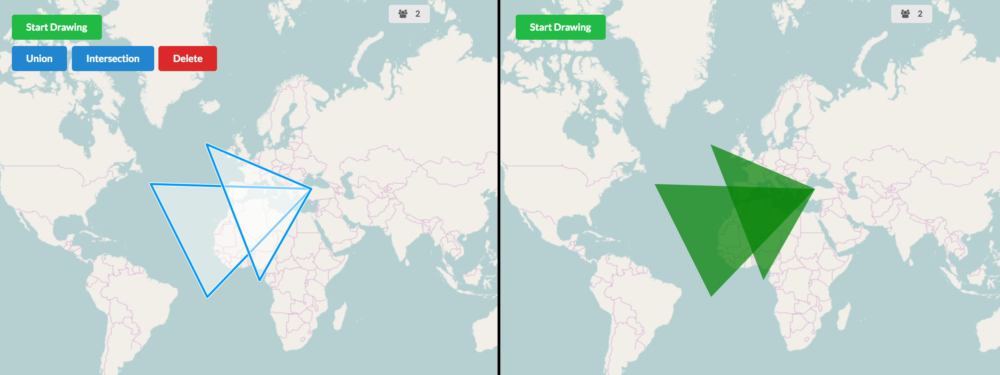
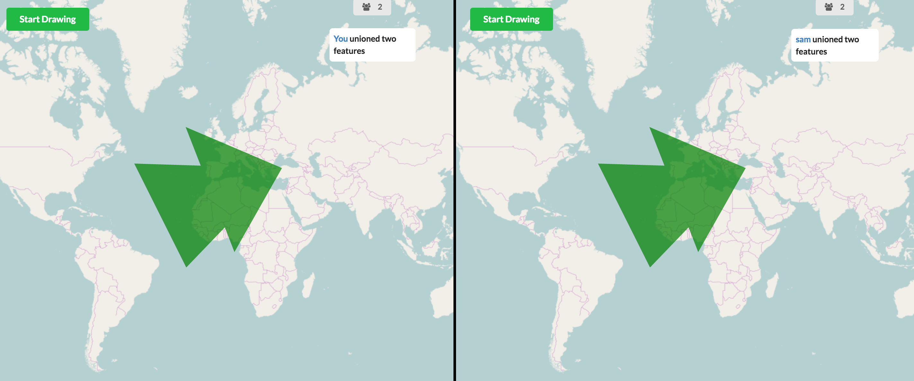

# Map Sync
A real-time mapping application (GIS) in the browser.

## What does it do?
In this application, users can join a session (by default, there is only one). After users have entered their names (nothing clever is done to prevent duplicate names), users can start interacting with the map.

For instance, users can draw features on the map (polygon features only). Once there are features on the map, users can perform the following operations:
* Delete
* Union (providing the features are contiguous)
* Intersection (providing the features do in fact intersect one another)
* Buffer

### An example of a user unioning two features

As can be seen on the left, the user has selected two features, and is presented with a list of operations that can be performed.


After performing a union, the server returns the new feature to both clients. The front-end also shows updates of what operation has been attempted/completed.

N.B. the front-end does not handle click-through, so it will just take the first feature it finds on the click event where multiple features are overlayed.

## Run the server
Install node modules, then run server:
```
npm install

node server.js
``` 
Tested on Node: `v7.2.0`

Navigate to your browser, and open up two or more windows, both pointing to: `http://localhost:3000`
